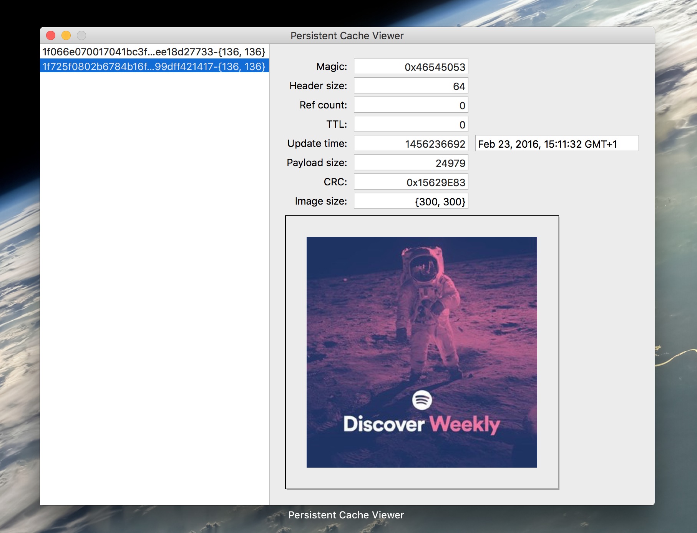

[](https://travis-ci.org/spotify/SPTPersistentCache)
[](https://codecov.io/github/spotify/SPTPersistentCache?branch=master)
[](http://cocoadocs.org/docsets/SPTPersistentCache/)
[](LICENSE)
[](https://cocoapods.org/?q=SPTPersistentCache)
[](https://github.com/Carthage/Carthage)
[](https://slackin.spotify.com)
[](http://clayallsopp.github.io/readme-score?url=https://github.com/spotify/sptpersistentcache)

Everyone tries to implement a cache at some point in their app’s lifecycle, and this is ours. This is a library that allows people to cache `NSData` with time to live (TTL) values and semantics for disk management.

- [x] 📱 iOS 8.0+
- [x] 💻 OS X 10.10+

## Architecture :triangular_ruler:
`SPTPersistentCache` is designed as an LRU cache which makes use of the file system to store files as well as inserting a cache header into each file. This cache header allows us to track the TTL, last updated time, the redundancy check and more. This allows the cache to know how often a file is accessed, when it was made, whether it has become corrupt and allows decisions to be made on whether the cache is stale.

The use of different files rather than a single binary file allows multiple reads/writes on different files within the cache without complicated blocking logic. The cache header in each file can be removed quite easily, this can be seen in the `SPTPersistentCacheViewer` tool that is made to run on OS X.

Included here is also the ability to schedule garbage collection over the cache, which allows the user to ensure they are never using too much space for commonly cache data (such as images).

## Installation :inbox_tray:
`SPTPersistentCache` can be installed in a variety of ways including traditional static libraries and dynamic frameworks.

### Static Library
Simply include `SPTPersistentCache.xcodeproj` in your App’s Xcode project, and link your app with the library in the “Build Phases” section.

### CocoaPods
We are indexed on [CocoaPods](http://cocoapods.org), which can be installed using [Ruby gems](https://rubygems.org/):
```shell
$ gem install cocoapods
```
Then simply add `SPTPersistentCache` to your `Podfile`.
```
pod 'SPTPersistentCache', '~> 1.1.0'
```
Lastly let CocoaPods do its thing by running:
```shell
$ pod install
```

### Carthage
We support [Carthage](https://github.com/Carthage/Carthage) and provide pre-built binary frameworks for all new releases. Start by making sure you have the latest version of Carthage installed, e.g. using [Homebrew](http://brew.sh/):
```shell
$ brew update
$ brew install carthage
```
You will also need to add `SPTPersistentCache` to your `Cartfile`:
```
github 'spotify/SPTPersistentCache' ~> 1.1.0
```
After that is all said and done, let Carthage pull in SPTPersistentCache like so:
```shell
$ carthage update
```
Next up, you need to add the framework to the Xcode project of your App. Lastly link the framework with your App and copy it to the App’s Frameworks directory under the “Build Phases”.

## Usage example :eyes:
For an example of this framework's usage, see the demo application `SPTPersistentCacheDemo` in `SPTPersistentCache.xcworkspace`.

### Creating the SPTPersistentCache
It is best to use different caches for different types of data you want to store, and not just one big cache for your entire application. However, only create one `SPTPersistentCache` instance for each cache, otherwise you might encounter anomalies when the two different caches end up writing to the same file.
```objc
NSString *cachePath = [NSSearchPathForDirectoriesInDomains(NSCachesDirectory, NSUserDomainMask, YES).firstObject stringByAppendingString:@"com.spotify.demo.image.cache"];

SPTPersistentCacheOptions *options = [SPTPersistentCacheOptions new];
options.cachePath = cachePath;
options.cacheIdentifier = @"com.spotify.demo.image.cache";
options.defaultExpirationPeriod = 60 * 60 * 24 * 30; // 30 days
options.garbageCollectionInterval = (NSUInteger)(1.5 * SPTPersistentCacheDefaultGCIntervalSec);
options.sizeConstraintBytes = 1024 * 1024 * 10; // 10 MiB
options.debugOutput = ^(NSString *string) {
    NSLog(@"%@", string);
};

SPTPersistentCache *cache = [[SPTPersistentCache alloc] initWithOptions:options];
```

### Storing Data in the SPTPersistentCache
When storing data in the `SPTPersistentCache`, you must be aware of the file system semantics. The key will be used as the file name within the cache directory to save. The reason we did not implement a hash function under the hood is because we wanted to give the option of what hash function to use to the user, so it is recommended that when you insert data into the cache for a key, that you create the key using your own hashing function (at Spotify we use SHA1, although better hashing functions exist these days). If you want the cache record, i.e. file, to exist without any TTL make sure you store it as a locked file.
```objc
NSData *data = UIImagePNGRepresentation([UIImage imageNamed:@"my-image"]);
NSString *key = @"MyHashValue";
[self.cache storeData:data
              forKey:key
              locked:YES
        withCallback:^(SPTPersistentCacheResponse *cacheResponse) {
             NSLog(@"cacheResponse = %@", cacheResponse);
        } onQueue:dispatch_get_main_queue()];
```

### Loading Data in the SPTPersistentCache
In order to restore data you already have saved in the `SPTPersistentCache`, you simply feed it the same key that you used to store the data.
```objc
NSString *key = @"MyHashValue";
[self.cache loadDataForKey:key withCallback:^(SPTPersistentCacheResponse *cacheResponse) {
    UIImage *image = [UIImage imageWithData:cacheResponse.record.data];
} onQueue:dispatch_get_main_queue()];
```
Note that if the TTL has expired, you will not receive a result.

### Locking/Unlocking files
Sometimes you may want to lock a file in `SPTPersistentCache` long after it has been expired by its TTL. An example of where we do this at Spotify is images relating to the cover art of the songs you have offlined (we wouldn't want to invalidate these images when you are away on vacation). When you have locked a file, you must make sure you unlock it eventually, otherwise it will stay around forever. A lock is basically a contract between the cache and it's consumer that the data will remain in the cache until it is explicitly unlocked.
```objc
NSString *key = @"MyHashValue";
[self.cache lockDataForKeys:@[key] callback:nil queue:nil];
// Now my data is safe within the arms of the cache
[self.cache unlockDataForKeys:@[key] callback:nil queue:nil];
// Now my data will be subject to its original TTL
```
Note: That if you exceed the constrained size in your cache, even locked files can be subject to pruning.

### Using the garbage collector
The garbage collection functionality in `SPTPersistentCache` is not automatically run, you have to call it manually using `scheduleGarbageCollector`.
```objc
[self.cache scheduleGarbageCollection];
```
This will schedule garbage collection on the interval you supplied in the `SPTPersistentCacheOptions` class, by default this is the `SPTPersistentCacheDefaultExpirationTimeSec` external variable. To unschedule the garbage collector simply call the opposite function `unscheduleGarbageCollector`.
```objc
[self.cache unscheduleGarbageCollection];
```

### Manually managing cache usage
There are times when you may want to pre-empty a garbage collection that is scheduled, wipe the cache or simply remove all locked/unlocked files indiscriminantly. To support these cases we have provided methods to do just this.
```objc
// Lets wipe all the files we haven't explicitly locked
[self.cache wipeUnlockedFiles];
NSLog(@"Size = %@", @(self.cache.totalUsedSizeInBytes));
// Now let's wipe all the files we have explicitly locked
[self.cache wipeLockedFiles];
NSLog(@"Size = %@", @(self.cache.totalUsedSizeInBytes));
// Why not just wipe the entire cache?
[self.cache prune];
NSLog(@"Size = %@", @(self.cache.totalUsedSizeInBytes));
```

## Background story :book:
At Spotify we began to standardise the way we handled images in a centralised way, and in doing so we initially created a component that was handling images and their caching. But then our requirements changed, and we began to need caching for our backend calls and preview MP3 downloads as well. In doing so, we managed to separate out our caching logic into a generic component that can be used for any piece of data.

Thus we boiled down what we needed in a cache, the key features being TTL on specific pieces of data, disk management to make sure we don't use too much, and protections against data corruption. It also became very useful to separate different caches into separate files (such as images and mp3s), in order to easily measure how much space each item is taking up.

## Tools :hammer:
Having a nice GUI tool to inspect the contents of an `SPTPersistentCache` directory would be nice, so we made one. In this repository we have a project called `SPTPersistentCacheViewer.xcodeproj` which is part of the `SPTPersistentCache.xcworkspace`. When you open it and build it for OS X, you will see a GUI that allows you to inspect the contents of a cache, including individual items TTL and payload size.



## Contributing :mailbox_with_mail:
Contributions are welcomed, have a look at the [CONTRIBUTING.md](CONTRIBUTING.md) document for more information.

## License :memo:
The project is available under the [Apache 2.0](http://www.apache.org/licenses/LICENSE-2.0) license.

### Acknowledgements
- Font in readme banner is “[Kyrilla Sans-Serif Bold](http://www.1001freefonts.com/kyrilla_sans_serif.font)” by [Manfred Klein](http://manfred-klein.ina-mar.com/).
- Icon in readme banner is “[Treasure Chest](https://thenounproject.com/term/treasure-chest/168777)” by Richard Cordero from the Noun Project.
